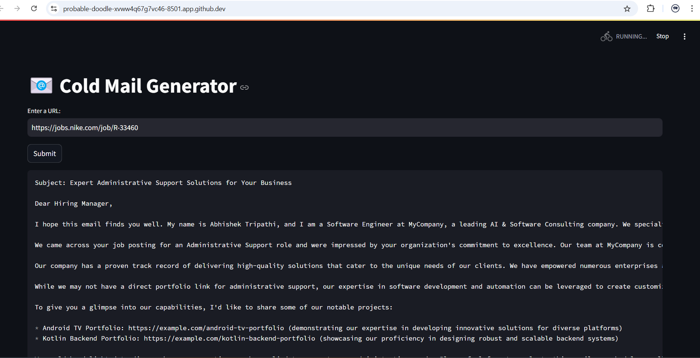

# ColdEmailGenerator
This repository is used to create cold Mails from one company according to their portfolio thats listed in the my_portfolio.csv, to another company that has opening for certain profile. 

This repo needs the url of the Job posting as input and creates a the Cold Mails as shown below.

Requirements before running:
1. The GROQ_API_KEY has to be added in the .env file inorder to run it.
2. Install the Streamlit using [this link](https://docs.streamlit.io/get-started/installation).
3. Install the langChain using "pip install -qU langchain-groq".
4. Install ChromaDB "pip install chromadb".
5. Install langChain Community to get the website scrapper using this command "pip install -qU langchain_community beautifulsoup4".
6. Make sure that you are using sqlite3 >= 3.35.0 as chroma requires it.

After all the requirements use the command "streamlit run main.py" to run the program.

Enjoy sending the Cold Mails every season.